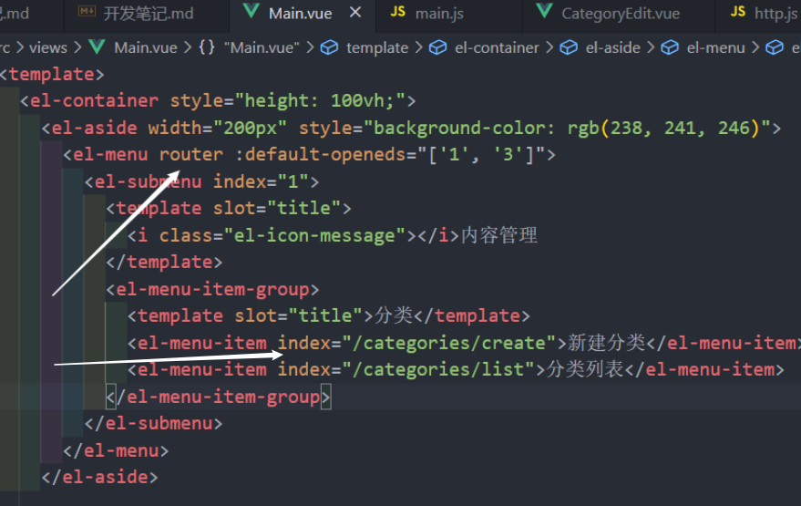
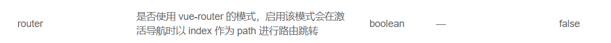
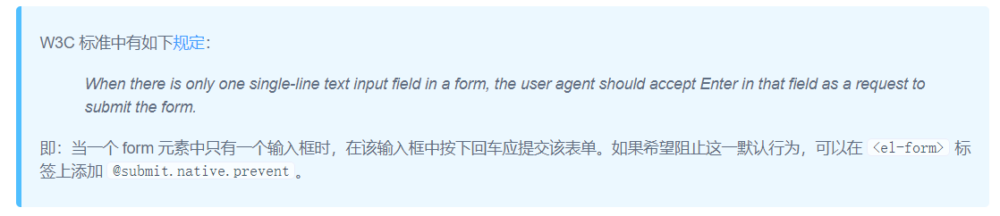

# 1. 初始化
- 在github上新建仓库，忽略清单为node，开源协议为MIT，同时生成readme.md文件
- 使用`vue create web``vue create admin`来分别创建页面和后台的项目文件夹
- 新建server文件夹，用于存放node的代码，使用`npm init -y`初始化
- server文件夹下创建index.js作为服务端入口文件
- 在server/package.json中添加快速启动命令`"serve": "nodemon index.js"`
- 在admin下执行`vue add element`，引入element插件,执行`vue add router`,引入路由

## 1.1 前端——管理页面admin的初始工作

### admin初始页面内容
1. 在views下创建Main.vue页面（删掉router.js和App.vue里初始化的东西）
2. 将Element-ui的container代码直接复制上去（记得加上template标签）
3. 将在router.js中添加Main.vue的路由（默认路由设置为Main.vue）
4. 在App.vue中添加一些初始的样式

### main.vue中的子路由
在main.vue组件中，左边的下拉栏是超链接，点击的时候需要跳转到对应的页面去（比如点击新建分类就要跳转到新建分类的页面去），但是这个页面不是完全跳转的，而是就右边变化，左边是不动的，因此我们要给main.vue添加子路由

1. 在`<el-menu>`标签中添加router属性，同时修改子菜单的路由
  
  

2. 在router/index.js下给Main添加子路由
```js
children:[
      {path: 'categories/create', component: CategoryEdit}
]
```

## 1.2 服务端的初始工作
### 插件
`npm i express@next mongoose cors`分别安装三个插件，cors为允许跨域请求

### 入口文件
在server/index.js下写一些初始的代码
```js
// 引入express框架
const express = require('express')
// 使用框架创建web服务器
const app = express()

// 引入中间件
app.use(express.json())
// 引入cors插件
app.use(require('cors')())

// 分类路由文件
require('./routers/admin/index')(app)
// 连接数据库文件
require('./plugins/db')(app)

app.listen(3000,() => {
  console.log('http://localhost:3000')
})
```

> 写法说明：上面在引入分类路由文件和连接数据库文件的时候直接调用了，说明两文件在导出的时候都是导出一个函数。

### 路由
分类路由不直接写在server/index.js下，写在server/router/admin/index.js下
```js
module.exports = app => {
  const express = require('express')
  // 创建路由对象
  const router = express.Router()

  // 引入数据库categories集合
  const Category = require('../../models/Category')

  //创建二级路由
  router.post('/categories',async(req,res) => {
    // 向集合中插入文档
    const model = await Category.create(req.body)
    res.send(model)
  })

  //为路由对象匹配请求路径
  app.use('/admin/api',router)
}

```


### 数据库
- 连接数据库相关代码写在server/plugins/db.js
```js
module.exports = app => {
  const mongoose = require('mongoose')
  mongoose.connect('mongodb://localhost:27017/node-vue-moba', {
    useNewUrlParser: true,
    useUnifiedTopology: true
  })
}
```
- 数据库集合规则创建相关代码写在server/models/Category.js下，该模块导出一个规则
```js
const mongoose = require('mongoose')

// 创建集合规则
const schema = new mongoose.Schema({
  name: { type: String }
})

// 使用集合规则创建集合，创建的集合叫categories
module.exports = mongoose.model('Category', schema)
```

### axios
1. npm i axios安装
2. src目录下创建http.js
```js
import axios from 'axios'

const http = axios.create({
  baseURL: 'http://localhost:3000/admin/api'
})

export default http
```
3. 在main.js中将http挂载到vue原型上，方便使用
```js
import http from './http.js'
Vue.prototype.$http = http
```


# 2. 功能实现——分类的增删改


## 2.1 创建分类

创建CategoryEdit组件，当点击子菜单后右部分就会变成这个组件，而左边不变
- 创建一个input输入框和一个按钮，用v-model将input输入框和model.name数据进行双向绑定
- 给表单添加`@submit.native.prevent`，阻止默认提交，去调用save方法
  
```js
async save() {
      let res;
      if (this.id) {
        // 当编辑（更新）分类时
        res = await this.$http.put(`categories/${this.id}`, this.model);
      } else {
        // 当新建分类时
        res = await this.$http.post("categories", this.model);
      }
      this.$router.push("/categories/list");
      this.$message({
        type: "success",
        message: "保存成功",
      });
    },
```
## 2.2 显示分类

- 创建CategoryList.vue组件，用于显示创建的分类

```vue
<template>
  <el-table :data="items">
        <el-table-column prop="_id" label="ID" width="240"></el-table-column>
        <el-table-column prop="name" label="分类名称"></el-table-column>
        <el-table-column fixed="right" label="操作" width="100"></el-table-column>
  </el-table>
</template>

<script>
  data(){
    return{
      items: []
    }
  }
</script>
```
- 当组件被创建时，调用fetch方法，显示数据

```js
methods:{
  async fetch() {
      const res = await this.$http.get("categories");
      this.items = res.data;
    }
},
created(){
  this.fetch()
}
```
- 后端接口

```js
  //获取分类列表接口
  router.get('/categories', async (req, res) => {
    const items = await Category.find().limit(10)
    res.send(items)
  })
```

## 2.3 编辑分类
说白了就是更新分类

- CategoryList中的更新按钮
```vue
<template slot-scope="scope">
  <el-button
    type="text"
    size="small"
    @click="$router.push(`/categories/edit/${scope.row._id}`)"
    >编辑</el-button>
</template>
```

- 后端跳转到对应id分类编辑接口
```js
  //获取分类详情页接口
  router.get('/categories/:id', async (req, res) => {
    const model = await Category.findById(req.params.id)
    res.send(model)
  })
```

点击之后跳转到id对应路由，因此我们需要在router/index.js中添加路由

- router添加动态路由

```js
  path: 'categories/edit/:id',
  component: CategoryEdit,
  props: true
```

这个时候点击编辑按钮，页面就会跳转到新建分类上，我们还需要把分类名字默认的显示到input上，

- 给CategoryEdit的save方法升级一下，更新分类的时候用put方法接口，创建分类用post方法接口,
同时当分类更新时，this.model要更新，所以我们在created中加一层判断：当有id时，去请求id对应的数据并把它赋值给model
```vue
<script>
export default{
  props: {
    this.id: {}
  },
  methods:{
    async save() {
      let res;
      if (this.id) {
        // 当编辑（更新）分类时
        res = await this.$http.put(`categories/${this.id}`, this.model);
      } else {
        // 当新建分类时
        res = await this.$http.post("categories", this.model);
      }
      this.$router.push("/categories/list");
      this.$message({
        type: "success",
        message: "保存成功",
      });
    },
    async fetch() {
      const res = await this.$http.get(`categories/${this.id}`);
      this.model = res.data;
    },
  },
  created(){
    this.id && this.fetch()
  }
}
</script>
```


- 后端更新分类接口和请求对应id接口
```js
  //编辑（更新）分类接口
  router.put('/categories/:id', async (req, res) => {
    const model = await Category.findByIdAndUpdate(req.params.id, req.body)
    res.send(model)
  })
    //获取分类详情页接口
  router.get('/categories/:id', async (req, res) => {
    const model = await Category.findById(req.params.id)
    res.send(model)
  })
```

## 2.4 删除分类
- CategoryList中的删除按钮
```js
<el-button type="text" size="small" @click="remove(scope.row)">删除</el-button>

async remove(row) {
      // console.log(row)
      this.$confirm(`是否删除分类 "${row.name}"`, "提示", {
        confirmButtonText: "确定",
        cancelButtonText: "取消",
        type: "warning",
      })
        .then(async () => {
          const res = await this.$http.delete(`categories/${row._id}`)
          this.$message({
            type: "success",
            message: "删除成功!",
          });
          this.fetch()
        })
        .catch(() => {
          this.$message({
            type: "info",
            message: "已取消删除",
          });
        });
    },
```

当确定删除时调用delete接口

- 后端接口
```js
  //删除分类接口
  router.delete('/categories/:id', async (req, res) => {
    // 删除分类
    await Category.findByIdAndDelete(req.params.id, req.body)
    res.send({
      success: true
    })
  })
```

## 2.5 子分类
我们通过分类的id字段来表示父子层级关系，但是数据库中所有数据依然是扁平的

- 在CategoryEdit中添加上级分类选项
```vue
<template>
 <el-form-item label="上级分类">
   <el-select v-model="model.parent">
     <el-option 
     v-for="item in parents" 
     :key="item._id"
     :label="item.name"
     :value="item._id"></el-option>
   </el-select>
 </el-form-item>
</template>

<script>
export default {
  data(){
    return {
      parents: []
    }
  },
  methods:{
    async fetchParents(){
      const res = await this.$http.get(`categories`);
      this.parents = res.data;
    }
  },
  created() {
    this.fetchParents()
  }
}
</script>
```

当我们选择上级后，这个时候创建数据就会有id，name和parents，但是在数据库中我们并没有将parents插入，因此我们需要更改数据库创建集合规则

- server/model/Category.js
```js
const schema = new mongoose.Schema({
  name: {
    type: String
  },
  parent: {
    type: mongoose.SchemaTypes.ObjectId,
    ref: 'Category'
  }
})
```

parent已经被添加到数据库中，接下来做的就是展示

展示之前还要做一件事，我们现在直接展示的话展示的实际上是上级分类的id，我们要获取到他的name，因此改一下后端接口
```js
 //获取分类列表接口
  router.get('/categories', async (req, res) => {
    const items = await Category.find().populate('parent').limit(10)
    res.send(items)
  })
```
populate()在一个文档中引用另一个集合中的文档，并将其填充到指定文档路径中。

然后展示

- CategoryList.vue
```js
<el-table-column prop="parent.name" label="上级"></el-table-column>
```

## 2.6 通用接口

### 为什么用通用接口
前面做完了分类的增删改查，但是后面还有许多类似操作比如英雄的、装备的增删改查等等，操作几乎都一样，因此我们把它写成通用的接口
比如一个接口
```js
router.post('/categories', async (req, res) => {
  // 向集合中插入文档
  const model = await Category.create(req.body)
  res.send(model)
})
```
请求地址/categories是不一样的（比如英雄可能请求/hero），模型也是不一样的，除此之外别的几乎都一样，因此我们把这两个东西设置成动态生成的

这里可以发现，**categories路径对应的就是Category模型**，这是一个**命名规范**（复数变成单数，首字母大写）

### 开始改造

先在请求前缀加一个rest区分别的非通用接口，后面跟一个动态参数
```js
app.use('/admin/api/rest/:resource', router)
```
这个时候所有接口中的categories就能删掉了
```js
router.post('/', async (req, res) => {
  // 向集合中插入文档
  const model = await Category.create(req.body)
  res.send(model)
})
```
url改完了，这个时候就要更换接口里的模型了，这个模型不能写死，也是传入的url动态生成的
这个模型就类似于这样找
```js
const Model = require(`../../models/${req.params.resource}`)
```
这个resource参数是在app.use里定义的，不能直接在接口里面用，需要加一些东西
```js
const router = express.Router({
  mergeParams: true
})
```
这个东西表示合并url参数，将父级app的参数合并到子级router里面来，这个时候就能在接口里面使用resource了

虽然看似已经能通过url传入的resource来动态生成模型路径了，但有一个问题，url传入的比如是categories，但是我们应该找到Category模型，直接找肯定是找不到的，因此我们需要转换一下

这个时候就用到了一个插件inflection,`npm i inflection`，这个插件专门用来处理一些单复数转换、格式转换等等
所以这个时候我们就能这么写
```js
const modelName = require('inflection').classify(req.params.resource)
const Model = require(`../../models/${modelName}`)
```


这两行代码每个接口都要用，因此我们把它做成中间件，直接加到app.use中

```js
app.use('/admin/api/rest/:resource', async (req, res, next) => {
  const modelName = require('inflection').classify(req.params.resource)
  req.Model = require(`../../models/${modelName}`)
  next()
}, router)
```
注意不能`const Model`，那样写在接口里访问不到，我们写成`req.Model`，表示给请求对象挂载一个Model，这样在接口中我们就通过`req.Model`来获取模型
```js
router.post('/', async (req, res) => {
  // 向集合中插入文档
  const model = await req.Model.create(req.body)
  res.send(model)
})
```
到此，通用接口已经做好了，但是获取分类列表接口还有点问题要改。之前我们写的默认去调用populate方法
```js
router.get('/', async (req, res) => {
  const items = await req.Model.find().populate('parent').limit(10)
  res.send(items)
})
```
但既然是通用接口了，我们就需要去判断当前url是否为分类，如果是再去调用
```js
router.get('/', async (req, res) => {
  const queryOptions = {}
  if(req.Model.modelName === 'Category'){
    queryOptions.populate = 'parent'
  }
  const items = await req.Model.find().setOptions(queryOptions).limit(10)
  res.send(items)
})
```


## 2.7 物品管理

没啥说的，代码都是分类直接复制过来的改改，接口也直接能使用通用的，再创建一个模型就行了

## 2.8 图片上传

- 首先写前端界面

element-ui里面直接有Upload，复制到ItemEdit即可
```js
<el-upload
  class="avatar-uploader"
  :action="$http.default.baseURL + '/upload'"
  :show-file-list="false"
  :on-success="afterUpload"
>
  
  <i v-else class="el-icon-plus avatar-uploader-icon"></i>
</el-upload>
```
里面的action要传完整的路径，这个action走的是ajax，所以不能像`this.$http.put(`rest/categories/${this.id}`, this.model);`这种axios一样写。

当上传成功后调用afterUpload方法

- 后端接口
这个图片上传接口不能使用通用接口了，他的接口地址是`admin/api/upload`

这里要注意，express不能获取到上传的图片的数据，因此需要使用multer这个模块。`npm i multer`

> body-parser组件只能处理enctype="application/x-www-form-urlencoded"编码的数据，并放到req.body中，所以如果含有图片等数据，需要借助中间件，这里使用multer中间件

然后开始写接口。首先引入multer模块
```js
const multer = require('multer')
```
然后使用multer，将上传的图片传输到指定的文件夹中，我们在server/下创建uploads目录用来存放上传进来的图片
```js
const upload = multer({
  dest: __dirname + '/../../uploads'
})
```

最后是接口
```js
app.post('/admin/api/upload', upload.single('file'), async (req, res) => {
  const file = req.file
  file.url = `http://localhost:3000/uploads/${file.filename}`
  res.send(file)
})
```
`upload.single('file')`表示接收name为file的上传数据，接口中我们给file拼接一个url，前端调用这个url显示图片

后端就好了，然后是前端，当上传成功后调用afterUpload方法展示图片

- afterUpload方法
按理说直接这么写就行了
```js
this.model.icon = res.url
```

但是不行
> 确保这个新 property 同样是响应式的，且触发视图更新。它必须用于向响应式对象上添加新 property，因为 Vue 无法探测普通的新增 property (比如 this.myObject.newProperty = 'hi')

普通添加的属性不能响应式，因此使用`$set`

但是想像开始那样写也可以，只需要先在model中把icon属性添加进去即可

```js
this.$set(this.model, 'icon', res.url)
```
这样图片就能显示出来了

- 最后在物品列表页面也展示图片

```js
<el-table-column prop="icon" label="图标">
  <template slot-scope="scope">
    
  </template>
</el-table-column>
```
## 2.9 英雄管理
和物品管理很像，直接复制，分别搞个HeroEdit,HeroList 就行，里面改改，再创建一个模型

- 模型Hero.js
这次的模型东西挺多的，名字、头像、称号、职业、评分、技能、出装和各种技巧，需要注意的就是英雄搭档、出装、职业都是关联的，`type`都是`mongoose.SchemaTypes.ObjectId`

- HeroEdit.vue
说几个地方
  - 类型
  ```js
  <el-form-item label="类型">
    <el-select v-model="model.categories" multiple>
      <el-option
        v-for="item in categories"
        :label="item.name"
        :value="item._id"
        :key="item._id"
      ></el-option>
    </el-select>
  </el-form-item>
  ```
  用的是el-select，加上multiple表示能多选，注意el-select里的v-model里的categories是选出来的分类的数据，`v-for`循环的是请求过来的所有分类的数据，俩不一样

  - 评分
  用的是el-rate，传入`:max="8"`表示最大分值，show-score属性表示星星后面显示分值数字，注意v-model，他可能会找不到model.scores，这时候要再data的model中添加scores属性。

  然而这个时候有一个bug！当新建一个英雄的时候你会发现评分是没有问题的，但是编辑的时候就会报错说找不到scores，原因很简单，我们写的fetch方法里，当编辑英雄时这个model是从服务端拿过来的（直接替代的）
  ```js
  async fetch() {
    const res = await this.$http.get(`rest/heros/${this.id}`);
    this.model = res.data;
  }
  ```
  这时候拿到的model肯定没有score啊，所以我们不能让他直接替代，而是把数据添加进我们的model中
  ```js
  async fetch() {
    const res = await this.$http.get(`rest/heros/${this.id}`);
    this.model = Object.assign({}, this.model, res.data);
  },
  ```
  > Object.assign() 方法用于将所有可枚举属性的值从一个或多个源对象复制到目标对象。它将返回目标对象。
  这里就是把我们的model和请求过来的数据都复制到一个空对象中，就是把俩放一块儿。这样就ok了

  
## 2.
## 2.
## 2.